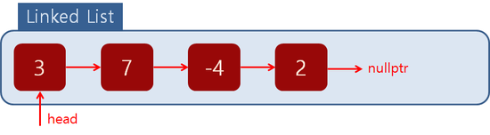

<h1><b> 연결리스트(Linked List) </b> </h1>

- 연결 리스트 구조
  - 자신이 보존 중인 값
  - 다음 노드를 가리키는 포인터
  - 첫번째 노드 : Head Node
- 연결 리스트 장점
  - 삽입과 삭제가 용이하다
  - time for Delete first, last node is O(1)
- 연결 리스트 단점
  - too long time indexing node
  - each node seperate from other node 
> 연결 리스트 개요
> 
연결 리스트는 Head Node와 nullptr을 가르키는 마지막 노드가 있다.

항목|연결리스트|배열|동적배열
:----|:----:|:----:|:----:
인덱싱|O(n)|O(1)|O(1)
Add/Del_front|O(1)|-|O(n)
Add/Del_end|O(n)|-|Full array : O()  other :O(1)
Add/Del_mid|O(n)|-|O(n)
Wasting Space|O(n)|0|O(n)
